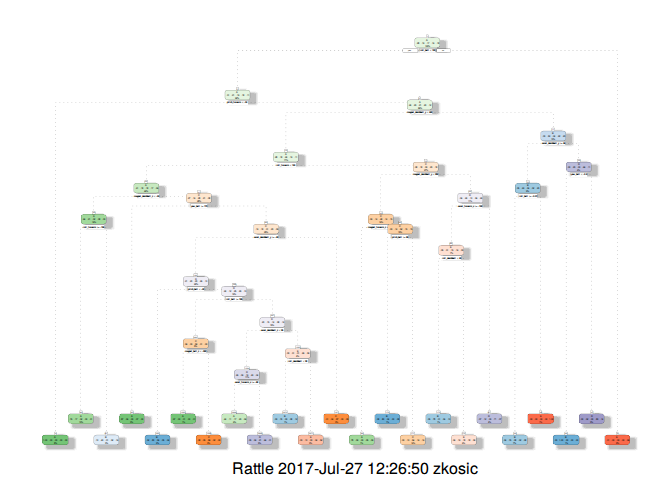
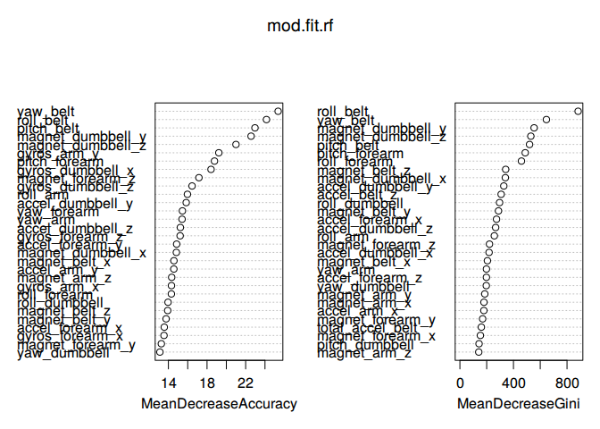

Predict Excercise Manner
================
Zvonko Kosic
August 26, 2016

Background
==========

Using devices such as Jawbone Up, Nike FuelBand, and Fitbit it is now possible to collect a large amount of data about personal activity relatively inexpensively. These type of devices are part of the quantified self movement – a group of enthusiasts who take measurements about themselves regularly to improve their health, to find patterns in their behavior, or because they are tech geeks. One thing that people regularly do is quantify how much of a particular activity they do, but they rarely quantify how well they do it. In this project, your goal will be to use data from accelerometers on the belt, forearm, arm, and dumbell of 6 participants. They were asked to perform barbell lifts correctly and incorrectly in 5 different ways. More information is available from the website here: <http://groupware.les.inf.puc-rio.br/har> (see the section on the Weight Lifting Exercise Dataset).

Project Intended Results
========================

The goal of your project is to predict the manner in which they did the exercise. This is the “classe” variable in the training set. You may use any of the other variables to predict with. You should create a report describing how you built your model, how you used cross validation, what you think the expected out of sample error is, and why you made the choices you did. You will also use your prediction model to predict 20 different test cases.

Your submission should consist of a link to a Github repo with your R markdown and compiled HTML file describing your analysis. Please constrain the text of the writeup to &lt; 2000 words and the number of figures to be less than 5. It will make it easier for the graders if you submit a repo with a gh-pages branch so the HTML page can be viewed online (and you always want to make it easy on graders :-). You should also apply your machine learning algorithm to the 20 test cases available in the test data above. Please submit your predictions in appropriate format to the programming assignment for automated grading. See the programming assignment for additional details.

Data
====

The training data for this project are available here: <https://d396qusza40orc.cloudfront.net/predmachlearn/pml-training.csv>

The test data are available here: <https://d396qusza40orc.cloudfront.net/predmachlearn/pml-testing.csv>

The data for this project come from this source: <http://groupware.les.inf.puc-rio.br/har>. If you use the document you create for this class for any purpose please cite them as they have been very generous in allowing their data to be used for this kind of assignment.

Exploratory Data Analysis
=========================

Readin the data into R and check their dimensions.

``` r
setwd("~/coursera/practical-machine-learning-assignment")
if(!file.exists("pml-training.csv")) {
  download.file("https://d396qusza40orc.cloudfront.net/predmachlearn/pml-training.csv", 
                destfile = "pml-training.csv")
}
if(!file.exists("pml-testing.csv")) {
  download.file("https://d396qusza40orc.cloudfront.net/predmachlearn/pml-testing.csv", 
                destfile = "pml-testing.csv")
}
training     <- read.csv("pml-training.csv", na.strings=c("", "NA", "NULL"))
testing.org  <- read.csv("pml-testing.csv",  na.strings=c("", "NA", "NULL"))

dim(training)
```

    ## [1] 19622   160

``` r
dim(testing.org)
```

    ## [1]  20 160

The next step is to remove variables that are not eligible as predictors like low variance or many NA values.

``` r
# library(caret)
nzv <- nearZeroVar(training, saveMetrics = TRUE)
training.nzv <- training[,nzv[, 'nzv' ] == 0]
dim(training.nzv)
```

    ## [1] 19622   117

Lets remove columns that really do not have any impact on the prediction on the excercise manner.

``` r
rm <- c('X', 'user_names', 'raw_timestamp_part_1', 'raw_timestamp_part_2', 'cvtd_timestamp', 'new_windows', 'num_window')
training.nzv.rm <- training.nzv[, -which(names(training.nzv) %in% rm)]
dim(training.nzv.rm)
```

    ## [1] 19622   112

The next step is to remove the columns with a lot of NA's

``` r
training.nzv.rm.na <- training.nzv.rm[ ,colSums(is.na(training.nzv.rm)) == 0]
dim(training.nzv.rm.na)
```

    ## [1] 19622    54

Remove colinear variables

``` r
corr.matrix <- cor(na.omit(training.nzv.rm.na [sapply(training.nzv.rm.na, is.numeric )]))
rm.corr <- findCorrelation(corr.matrix, cutoff = .9, verbose=FALSE)
training.nzv.rm.na.corr <- training.nzv.rm.na[,-rm.corr]
train <- training.nzv.rm.na.corr
dim(train)
```

    ## [1] 19622    47

``` r
#train <- subset(train, select = -c(classe))
```

### Split Data to Training and Testing

``` r
library(caret)
in.train <- createDataPartition(y=train$classe, p=0.7, list=FALSE)
training <- train[ in.train,]
testing  <- train[-in.train,]
dim(training)
```

    ## [1] 13737    47

``` r
dim(testing)
```

    ## [1] 5885   47

Prediction Analysis
===================

Regression Tree
---------------

Start with a regression tree with summarization and a plot.

``` r
library(rpart)
library(rattle)
```

    ## Rattle: A free graphical interface for data mining with R.
    ## Version 4.1.0 Copyright (c) 2006-2015 Togaware Pty Ltd.
    ## Type 'rattle()' to shake, rattle, and roll your data.

``` r
mod.fit.tree <- rpart(classe ~ .,method="class",data=training)
```

Now lets have a look at the created tree

``` r
fancyRpartPlot(mod.fit.tree)
```

    ## Warning: labs do not fit even at cex 0.15, there may be some overplotting



Cross Validation
----------------

Lets predict an see how good the regression tree fits as a model

``` r
pred.tree <- predict(mod.fit.tree, testing, type="class")
confusionMatrix(pred.tree, testing$classe)
```

    ## Confusion Matrix and Statistics
    ## 
    ##           Reference
    ## Prediction    A    B    C    D    E
    ##          A 1526  185   92  120   23
    ##          B   51  734   46   83   76
    ##          C   41   80  759  152  126
    ##          D   31   54   54  511   44
    ##          E   25   86   75   98  813
    ## 
    ## Overall Statistics
    ##                                           
    ##                Accuracy : 0.738           
    ##                  95% CI : (0.7265, 0.7492)
    ##     No Information Rate : 0.2845          
    ##     P-Value [Acc > NIR] : < 2.2e-16       
    ##                                           
    ##                   Kappa : 0.6664          
    ##  Mcnemar's Test P-Value : < 2.2e-16       
    ## 
    ## Statistics by Class:
    ## 
    ##                      Class: A Class: B Class: C Class: D Class: E
    ## Sensitivity            0.9116   0.6444   0.7398  0.53008   0.7514
    ## Specificity            0.9003   0.9461   0.9179  0.96281   0.9409
    ## Pos Pred Value         0.7842   0.7414   0.6554  0.73631   0.7411
    ## Neg Pred Value         0.9624   0.9173   0.9435  0.91273   0.9438
    ## Prevalence             0.2845   0.1935   0.1743  0.16381   0.1839
    ## Detection Rate         0.2593   0.1247   0.1290  0.08683   0.1381
    ## Detection Prevalence   0.3307   0.1682   0.1968  0.11793   0.1864
    ## Balanced Accuracy      0.9059   0.7952   0.8288  0.74645   0.8461

With an accuracy of **0.7298** we are not really good ad predicting lets try another method an see if the results can get better.

Random Forests
--------------

Random forests fit a whole bunch of random decision trees and fit the best combination of them for a prediction model.

``` r
require(randomForest)
```

    ## Loading required package: randomForest

    ## randomForest 4.6-12

    ## Type rfNews() to see new features/changes/bug fixes.

``` r
set.seed(666)
mod.fit.rf <- randomForest(classe~., data=training, ntree=100, importance=TRUE)
mod.fit.rf
```

    ## 
    ## Call:
    ##  randomForest(formula = classe ~ ., data = training, ntree = 100,      importance = TRUE) 
    ##                Type of random forest: classification
    ##                      Number of trees: 100
    ## No. of variables tried at each split: 6
    ## 
    ##         OOB estimate of  error rate: 0.63%
    ## Confusion matrix:
    ##      A    B    C    D    E class.error
    ## A 3902    4    0    0    0 0.001024066
    ## B   20 2630    8    0    0 0.010534236
    ## C    0   13 2379    4    0 0.007095159
    ## D    0    0   26 2224    2 0.012433393
    ## E    0    1    4    5 2515 0.003960396

Now predict with the fitted random forest model.

``` r
require(caret)
```

    ## Loading required package: caret

    ## Loading required package: lattice

    ## Loading required package: ggplot2

    ## 
    ## Attaching package: 'ggplot2'

    ## The following object is masked from 'package:randomForest':
    ## 
    ##     margin

``` r
require(randomForest)
pred.rf <- predict(mod.fit.rf, testing, type="class")
confusionMatrix(pred.rf, testing$classe)
```

    ## Confusion Matrix and Statistics
    ## 
    ##           Reference
    ## Prediction    A    B    C    D    E
    ##          A 1673    2    0    0    0
    ##          B    1 1135    3    0    0
    ##          C    0    1 1019   14    0
    ##          D    0    1    4  949    5
    ##          E    0    0    0    1 1077
    ## 
    ## Overall Statistics
    ##                                           
    ##                Accuracy : 0.9946          
    ##                  95% CI : (0.9923, 0.9963)
    ##     No Information Rate : 0.2845          
    ##     P-Value [Acc > NIR] : < 2.2e-16       
    ##                                           
    ##                   Kappa : 0.9931          
    ##  Mcnemar's Test P-Value : NA              
    ## 
    ## Statistics by Class:
    ## 
    ##                      Class: A Class: B Class: C Class: D Class: E
    ## Sensitivity            0.9994   0.9965   0.9932   0.9844   0.9954
    ## Specificity            0.9995   0.9992   0.9969   0.9980   0.9998
    ## Pos Pred Value         0.9988   0.9965   0.9855   0.9896   0.9991
    ## Neg Pred Value         0.9998   0.9992   0.9986   0.9970   0.9990
    ## Prevalence             0.2845   0.1935   0.1743   0.1638   0.1839
    ## Detection Rate         0.2843   0.1929   0.1732   0.1613   0.1830
    ## Detection Prevalence   0.2846   0.1935   0.1757   0.1630   0.1832
    ## Balanced Accuracy      0.9995   0.9978   0.9950   0.9912   0.9976

With **random forest** approach we get an accuracy of **99,47%** which is much better than with a simple regression tree approach.

``` r
require(randomForest)
varImpPlot(mod.fit.rf)
```

 This plot shows the important variables of the model they form a part of prediction power of the **Random Forest** model. If the top variable from the model is dropped, the prediction power will greatly reduce. On the other hand if a variable from the bottom is remove, there might not be much impact on prediction power of the model.

Results
=======

Now generate the Answers.

``` r
result <- predict(mod.fit.rf, testing.org)
result
```

    ##  1  2  3  4  5  6  7  8  9 10 11 12 13 14 15 16 17 18 19 20 
    ##  B  A  B  A  A  E  D  B  A  A  B  C  B  A  E  E  A  B  B  B 
    ## Levels: A B C D E
